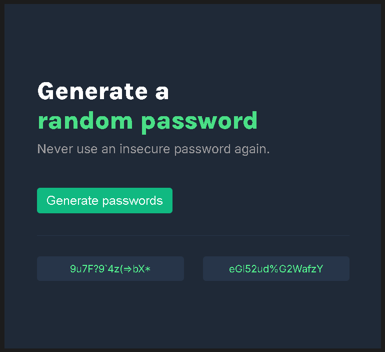

# 🔐 Password Generator

A simple password generator built with **HTML**, **CSS**, and **JavaScript** as part of the Scrimba Frontend Developer Career Path.

## 📷 Preview



## 🚀 Features

- Generate two random passwords at once.
- Each password contains 15 random characters.
- Copy any generated password to the clipboard with a single click.
- Visual confirmation after copying a password.

## 🛠️ Technologies

- HTML5
- CSS3
- JavaScript (Vanilla)

## 🎯 Learning Goals

This project was created to practice:

- DOM manipulation
- Event handling
- Random number generation
- Functions and code reuse
- Clipboard API
- CSS Flexbox

## ▶️ Live Demo

Coming soon...

## 📂 Installation

Clone the repository:

```bash
git clone https://github.com/sanleomon/password-generator.git
```

Open the project folder and install the dependencies:

```bash
npm install
```

Run the development server:

```bash
npm run dev
```

## 📄 License

This project is intended for learning purposes.